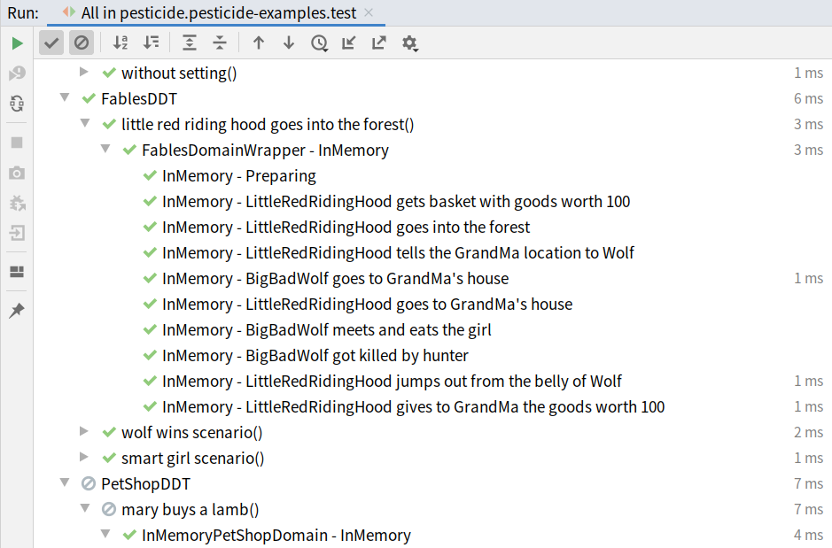

[](https://maven-badges.herokuapp.com/maven-central/com.ubertob.pesticide/pesticide-core)

# Pesticide

A Library To Write Domain-Driven Tests, written in Kotlin (but it works in Java projects as well).

My presentation about Pesticide:
[](https://youtu.be/cUNVTXf6LxY)

## What a DDT is?

Unit-Tests are very useful but they work on a small scale, we can test only a few objects or functions in this way.

We also need a way to test our full application end-to-end in order to be sure to be on the right track. We can do that simulating user clicking on the web page but we need a more abstract way to represent it, otherwise, tests would become quickly very hard to understand.

Nat Pryce invented the Domain-Driven style of tests when he got tired of tests written in a way "click here and then click there".

[video](https://www.youtube.com/watch?v=Fk4rCn4YLLU)

They also are influenced by Serenity and the Screenplay pattern by Anthony Marcano.

[article](https://www.infoq.com/articles/Beyond-Page-Objects-Test-Automation-Serenity-Screenplay/)

They have been named from the concern that tests should concentrate on the business domain, and he named this style DDT also as a pun since they are quite efficient in killing bugs (like the pesticide).

Having a single interface for two or more representations of our System forces us to define a common language independently of technical details. This practice is called [`lingua franca`](https://wiki.c2.com/?LinguaFrancaPattern).

We also aim to use the same terms both in our tests and in the conversation with the business people. In this way, we can facilitate the communication between people working on the software and the business domain experts. See [`ubiquitous language`](https://martinfowler.com/bliki/UbiquitousLanguage.html)

The goal is to describe our stories as interactions between actors [see why here](https://www.infoq.com/presentations/pragmatic-personas/) and as an abstraction of our system. Using different system implementations we can reach these benefits:

- Test the functionality works both end-to-end and in the in-memory domain
- Document the story using a language close to the business
- Describing test without using UI details (click here/insert text there)
- Make sure there is no business logic in the infrastructure layer
- Make sure there is no infrastructure details in the business logic

## How does Pesticide work?
See some Kotlin examples in the pesticide-example project, and some Java examples in the pesticide-example-java project.

- CalculatorDDT: the simplest example
- FablesDDT: an in-memory only example to see how the narrative flows
- GooglePageDDT: a http/html only example to see how to integrate with WebDriver
- PetShopDDT: a full example on how to test restful apis using Http4k
- StackDDT: a simple example to see how to use it from Java

## What does it look like?

[FablesDDT example code](pesticide-examples/src/test/kotlin/com/ubertob/pesticide/examples/fables/FablesDDT.kt)



## Dependency declaration
Maven
```
<dependency>
  <groupId>com.ubertob.pesticide</groupId>
  <artifactId>pesticide-core</artifactId>
  <version>1.1</version>
</dependency>
```

Gradle
```
testImplementation 'com.ubertob.pesticide:pesticide-core:1.1'
```

## Acknowledgement

I want to thank first Nat Pryce for having introduced me to the DDT concept and the long hours spent pairing together that helped me to finally understand it.

We also stealed a lot of good ideas to Antony Marcano's Serenity project.

Duncan McGregor's Minutest project was also a big inspiration for me, both as api design and technical implementation.

Last but not least, my current team: Asad Manji, Tom Power, Andrew Couchman, Andrew Gray and the rest of the developers for suggestions, contribution and in general having great time working together.